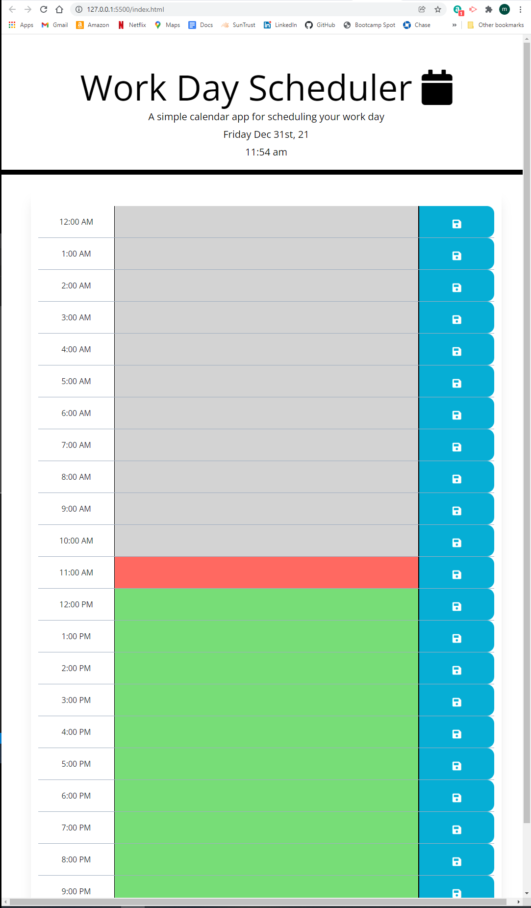

# Day-Planner
A simple day planner using third party APIs

## Host Location:
https://mattplawrence.github.io/Day-Planner/

## Purpose:
The purpose of this project was to create a day planner that allows a user to enter hour by hour events that are saved in local storage.

## Problem:
The problem is to use frameworks to create a user friendly website that updates with the current time, and stores events for the day.

### The problems encountered include:
* Creating a three column layout that allows for user inputs.
* sinking the current time to the site.
* generating hourly rows for information storage.
* Storing all saved information to local storage for retention.

## What I learned:
I learned how to use Bootstrap and Jquery and Moment to create a functioning website. 

## Preview:
The website landing page as written in this repository should look like the following image:

